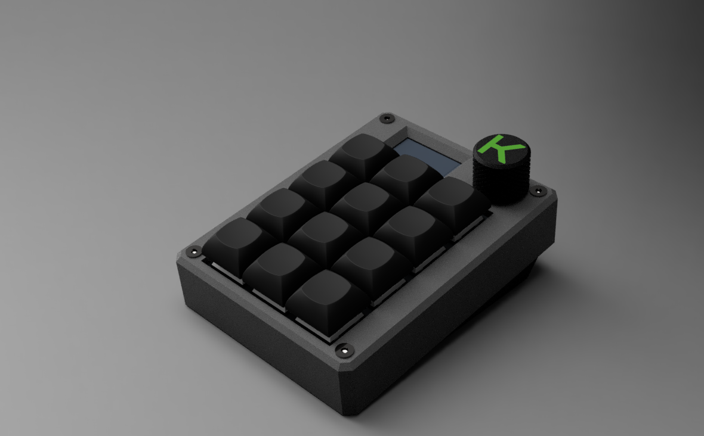
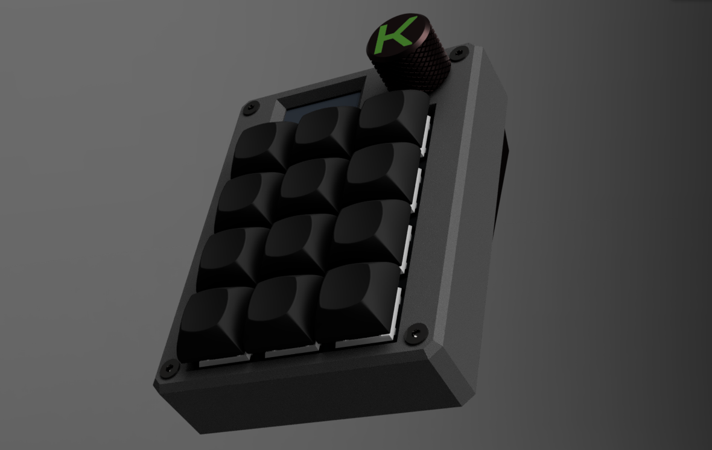
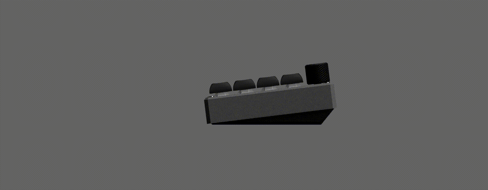
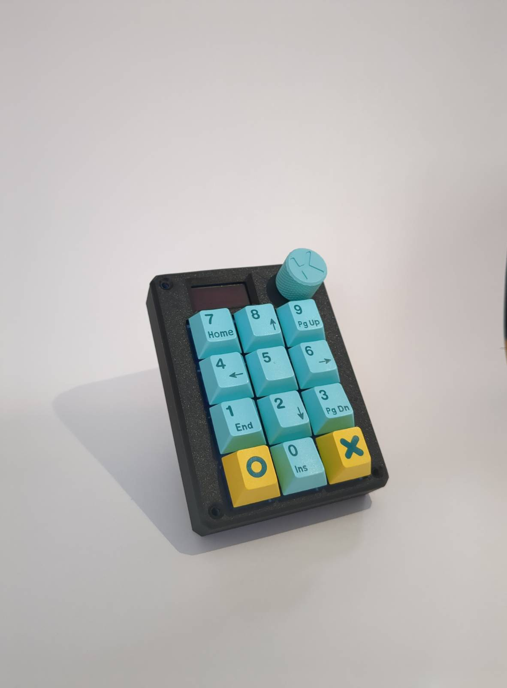
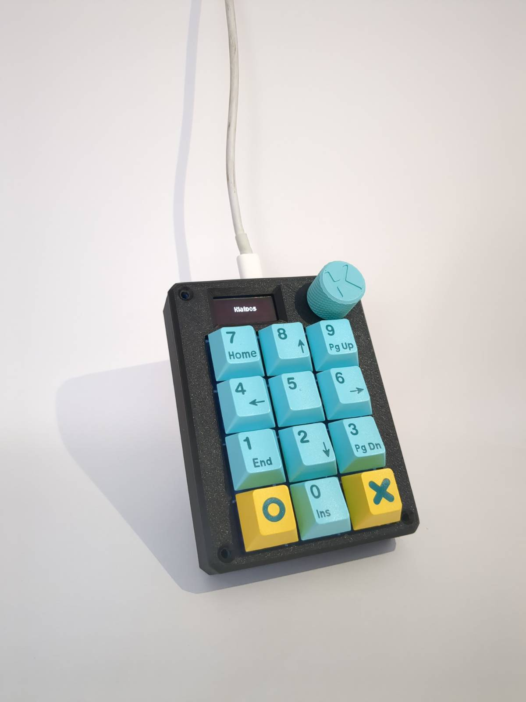
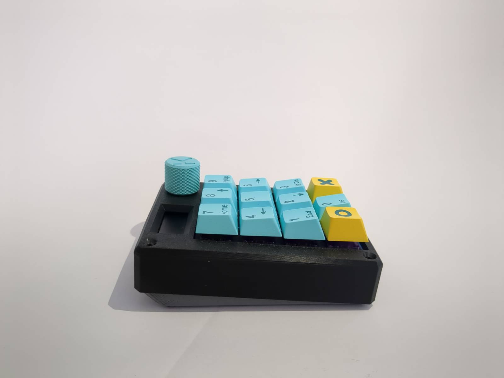

# Klados
*'klados' - Greek for branch, offshoot*  
Like a branch from a tree, this macropad is designed to be an extension of your keyboard.  
This is version two of my macropad, made for [Hackpad](https://hackpad.hackclub.com) and now redesigned for [Reboot](https://reboot.hackclub.com).  
See the initial version [here](https://github.com/AethelVeritas/hackpad/tree/main/hackpads/One%20Pad%20To%20Rule%20Them%20All).

<!-- Hack Club Badge -->

---

# Gallery

# BOM
- 1 x Seeed Xiao RP2040 MCU
- 12 x Cherry MX switches
- 12 x DSA/MX compatible keycaps
- 1 x EC11E/EC11 rotary encoder
- 1 x 128*32 SSD1306 OLED screen
- 1 x PCB
- 4 x M3 * 16-18mm flathead screws
- 4 x M3 heat inserts
- 1 x Printed switch plate 
- 1 x Printed case 
- 1 x Printed bottom plate 
- 1 x Encoder knob 

# License

Klados is licensed under CERN-OHL-P-2.0.
